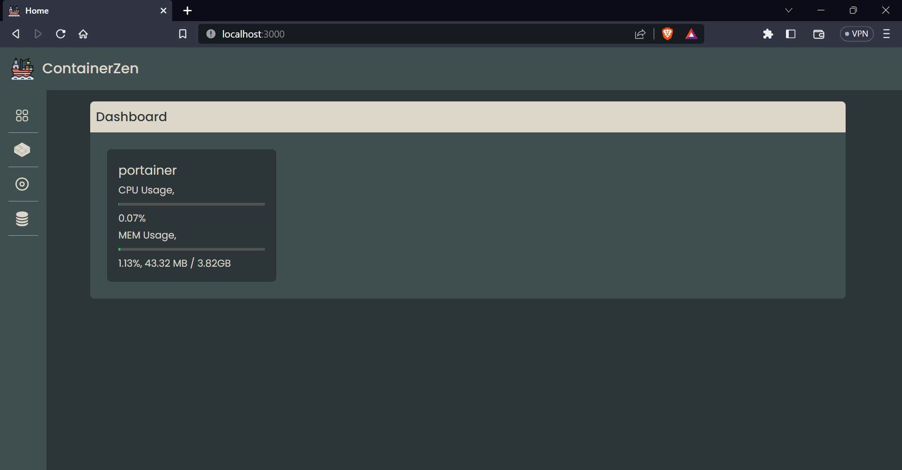
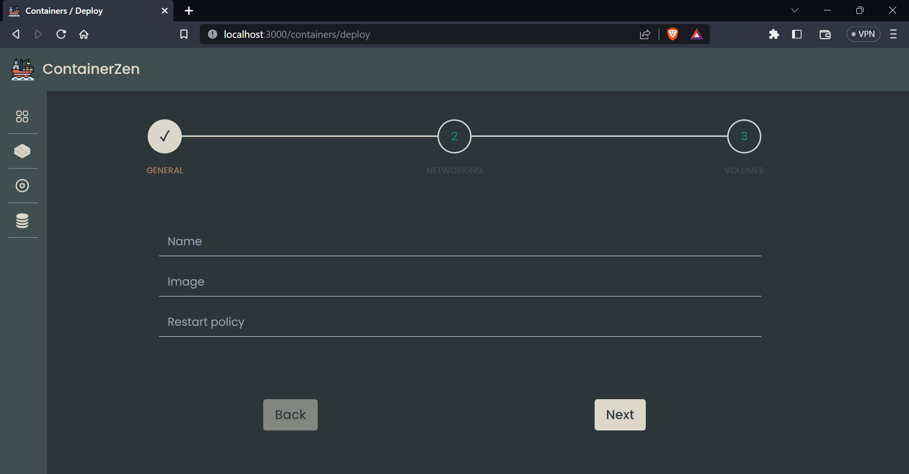

# ContainerZen
ContainerZen - A Docker Container Manager

# Contents
- Project Description
- Functionalities
- Tech Stack
- Preview

# Project Description
ContainerZen is a Docker container manager
# Contents
- Project Description
- Functionalities
- Tech Stack
- Preview

# Project Description
ContainerZen is a Docker container manager which helps the management of docker containers, volumes, and images. With ContainerZen, users can effortlessly create, delete, and update Docker containers while maintaining control over their entire container ecosystem.

# Functionalities
- User can create, and delete a container. 
- User can start, stop, restart an existing containers.
- User can create, and delete an Image.
- User can create, and delete an Volume.

# Tech Stack
- NextJS, TailwindCSS
- ExpressJS

# Preview

## Dashboard
<kbd></kbd>

## Menu
<kbd></kbd>

## Containers
<kbd></kbd>

## Container Creation
<kbd></kbd>

## Volumes
<kbd></kbd>

## Volume Creation
<kbd></kbd>

## Images
<kbd></kbd>

## Image Creation
<kbd></kbd>

`Thank you!🧑‍💻`